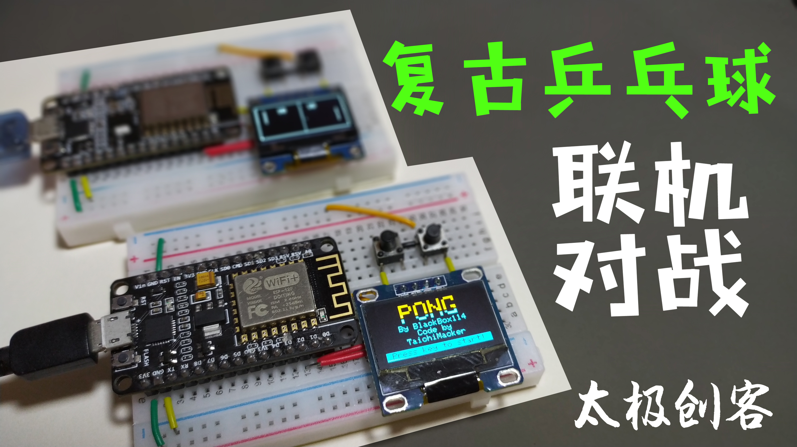
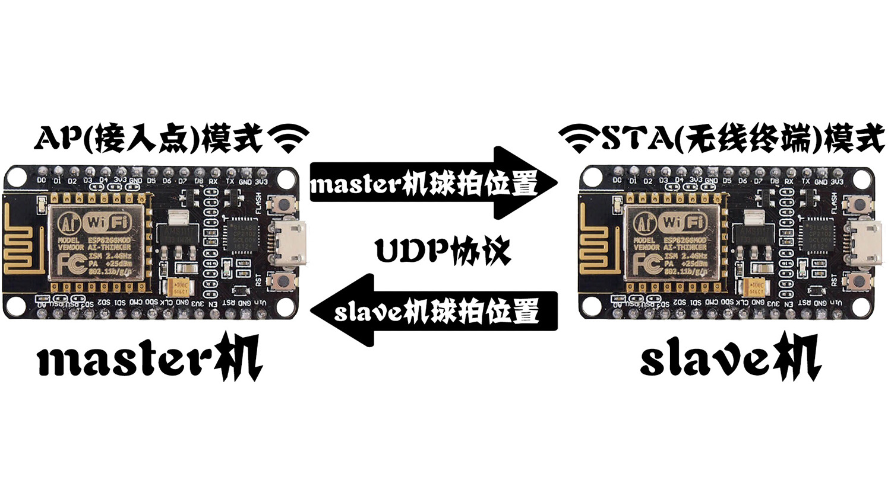
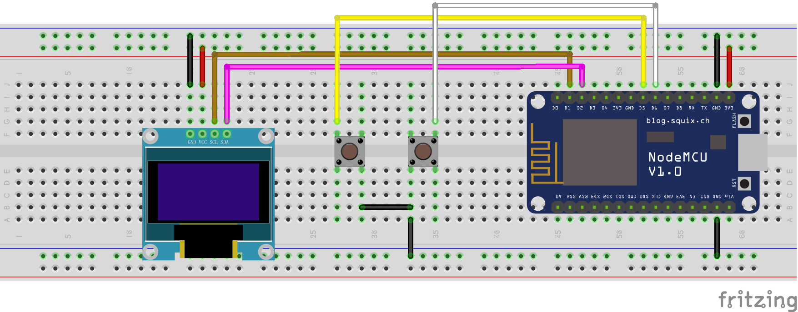
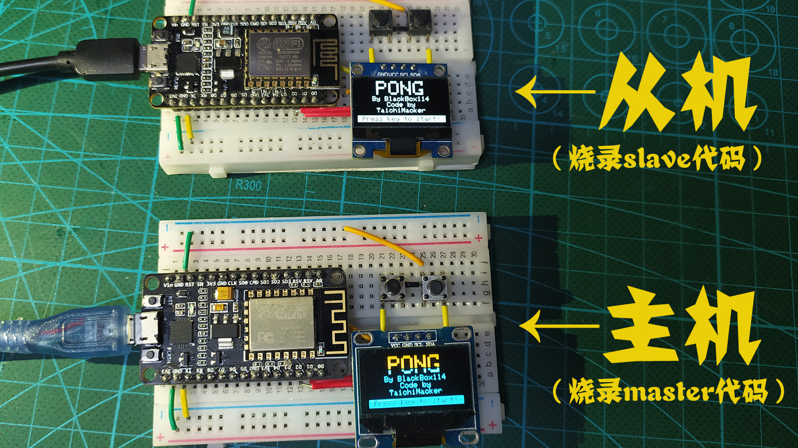
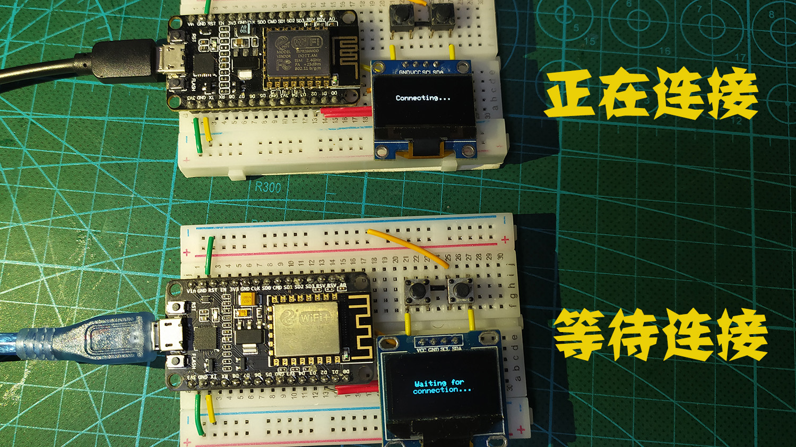
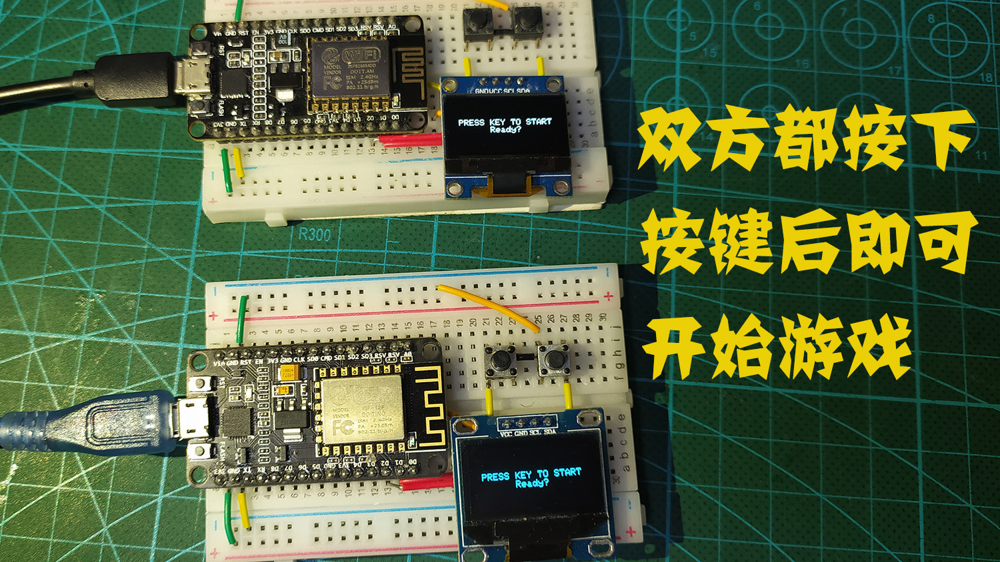
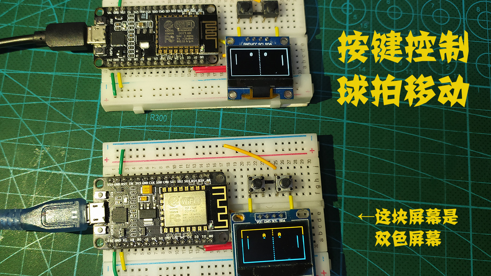

# ESP8266_Multiplayer_Pong

 

### 总览

基于ESP8266的网络多人乒乓游戏 / Multiplayer Pong Game based on ESP8266 Network是一个基于wifi，使用UDP协议进行数据传输的双人对战游戏。双方准备好后按下按键即可开始游戏。内置的游戏是一个简单的PONG(乒乓)游戏，有判断胜负的逻辑和计分的功能。硬件仅使用0.96寸，支持I2C协议的oled和ESP8266-NodeMCU开发板，以及按键开关组成。

### 运行说明

联机对战需要两台机子，两块8266开发板之间需要通过wifi进行连接。其中开启AP模式的是master机，开启STA模式的是slave机。游戏过程中，两台机子之间通过UDP协议传输己方球拍的位置数据，同时接受对方球拍的位置数据，以此达到数据同步的联机游戏效果。若对8266的AP模式和STA模式有疑问，请参阅[此处](http://www.taichi-maker.com/homepage/iot-development/iot-dev-reference/esp8266-c-plus-plus-reference/)。若不了解UDP协议在本游戏中的具体应用，可以参看[此例程](http://www.taichi-maker.com/homepage/iot-development/iot-dev-reference/esp8266-c-plus-plus-reference/wifiudp/esp8266-udp-led/)进一步了解

 

### 材料清单
|         材料          | 数量 |
| :-------------------: | :--: |
| ESP8266-NodeMCU开发板 |  2   |
|     0.96寸OLED屏      |  2   |
|       按键开关        |  4   |
|         跳线          | 若干 |
|        面包板         |  2   |

### 接线图

请按照接线图搭建两套硬件用于联机对战。

 

### 代码和使用库
代码位于/src文件夹下。分别为master.ino和slave.ino，请分别烧录进两套硬件中。
使用的第三方库有：

- Adafruit_GFX库
- Adafruit_SSD1306库

请前往[太极创客第三方库下载页面](http://www.taichi-maker.com/homepage/download/#library-download)进行下载。

如果对ESP8266-NodeMCU开发板的使用有疑问，请参看[此处](http://www.taichi-maker.com/homepage/esp8266-nodemcu-iot/iot-c/esp8266-iot-basics/)的说明

如果对添加第三方库库有疑问，请参看[此处](http://www.taichi-maker.com/homepage/reference-index/arduino-library-index/install-arduino-library/)的说明

如果对烧录代码到8266有疑问，请参看[此处](http://www.taichi-maker.com/homepage/esp8266-nodemcu-iot/iot-c/esp8266-iot-basics/)的说明

### 操作说明

#### step1

代码正常烧录后，主机和从机接通电源，会显示初始界面↓

 

#### step2

按照oled显示的说明，按下任意按键可以进入wifi连接状态。此时主机和从机开始尝试进行连接↓

 

#### step3

wifi连接完成后，oled会提示，当玩家准备好开始游戏后按下按键↓

 

#### step4

当双方均按下按键时，游戏正式开始。两个按键代表上下移动球拍，一旦一方没有接住球，另一方就会增加一分。游戏将持续进行↓

 

### 待优化的问题

您如果进行了游戏，可以看到，双方传输数据其实是有一定延迟的。而且除了球拍的位置数据互相传输以外，其实没有其他数据交互。相当于一旦因为延迟出现误差，主机和从机会出现不同步的游戏局面。这一点可通过增加球位置校验等方法解决，也可以通过进一步优化代码来解决。您可以尝试修改或升级这个简单的游戏，解决这些小瑕疵。我们也会继续优化代码，以追求更优的效果。

### 更多信息

这个小制作只是展示了8266网络对战的效果，用到的物联网相关应用知识并不困难。如果您想学习更多物联网开发相关知识，请访问[太极创客官网](http://www.taichi-maker.com/)获取更多教程。

