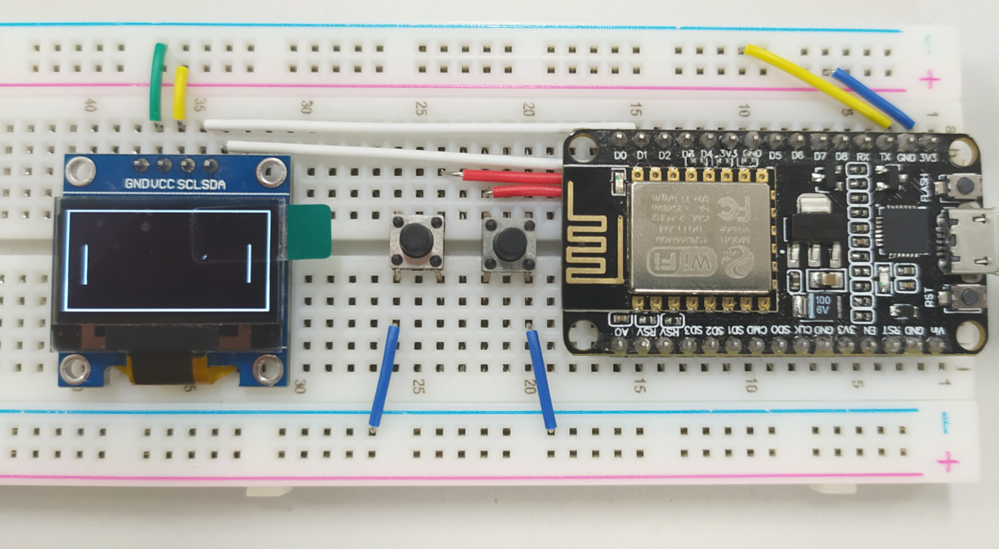

# ESP8266_Multiplayer_Pong

 

基于ESP8266的网络多人乒乓游戏 / Multiplayer Pong Game based on ESP8266 Network

### 截止到2020.07.10

完成：

带界面和计分的单人游戏demo

未完成：

联网对战

### 时间节点
2020.7.11完成计分功能【已完成】

2020.7.13完成联网对战功能

